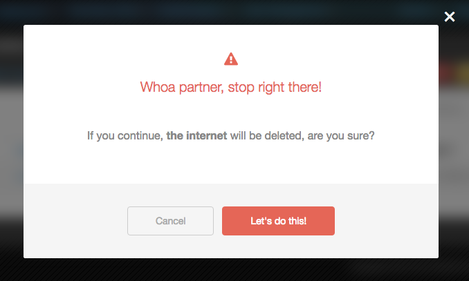

# jQuery Confirm Action



## Getting Started

```html
<script type="text/javascript" src="./jquery.confirm-action.js"></script>
```

```javascript
$('.my-button').confirmAction({
    title: {
        text: 'Whoa!'
    },
    message: {
        text: 'You are about to do a bad thing, are you sure?'
    }
});
```

## Advanced Usage

```javascript
$('.my-button').confirmAction({
    title: {
        html: [
            '<i class="fa fa-warning"></i><br />',
            'Stop right there!'
        ].join('\n'),
        style: 'danger'
    },
    message: {
        html: 'You are about <strong>delete the internet</strong>, are you sure?'
    },
    actions: {
        confirm: {
            text: 'Go Ahead',
            callback: function(confirm, cancel) {
                confirm();
            }
        }
    }
});
```
